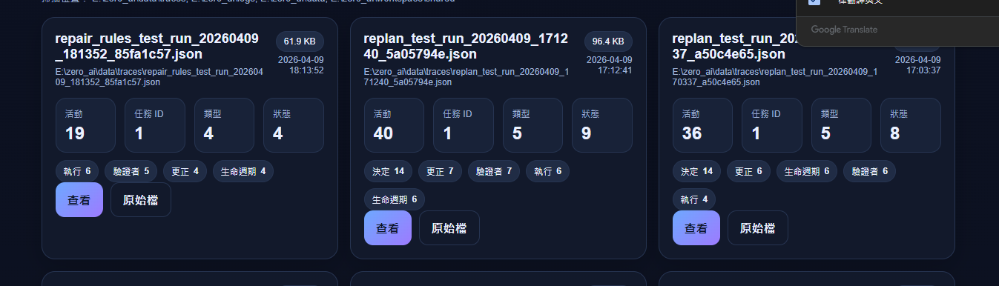

# ZERO AI

> An early-stage self-correcting agent runtime (local-first, execution-focused)

---

## Overview

ZERO is a local-first AI system designed to execute tasks through structured planning, execution, verification, and correction.

It is not just a chatbot or script runner.

ZERO focuses on building a **runtime-controlled agent loop**, where execution is continuously validated and adjusted instead of assumed to be correct.

---

## Core Loop

Plan → Execute → Verify → Correct → Retry / Replan → Re-execute

This loop is the foundation of ZERO.

---

## What ZERO Does (Current Capabilities)

ZERO has demonstrated the following behaviors in local runtime tests:

- multi-step task execution  
- verification-driven failure detection  
- retry for recoverable errors  
- replanning when retry is insufficient  
- executor-level repair for invalid step sequences  
- basic dependency-aware execution (e.g. missing file / directory repair)  
- trace-based observability of execution loops  

---

## Key Idea

Most LLM-based systems follow:

Plan → Execute → Done

ZERO is built on a different assumption:

- plans can be incorrect  
- execution can fail  
- results must be verified  
- the system must adapt  

---

## Executor-Level Repair (Deterministic Layer)

ZERO does not rely only on planner output.

It introduces a deterministic execution layer that can fix obvious issues before or during execution.

Example (validated behavior):

Planner output:
read hello.txt

Executor adjusts:
create hello.txt → read hello.txt

This allows recovery from common dependency errors without immediately requiring replanning.

---

## Dependency Repair (Early Implementation)

In current tests, ZERO can handle simple dependency chains:

Example:

Attempt:
read nested/demo/hello.txt

Runtime repair:
- create directory (nested/demo)
- create file (nested/demo/hello.txt)
- then execute read

This behavior is rule-based and currently limited, but demonstrates a path toward more robust execution control.

---

## Agent Loop Trace

The system records:

- execution
- verification
- correction
- iteration cycles

This makes behavior observable and debuggable.

---

## Current Position

ZERO is not a finished product.

It is an **early-stage agent runtime prototype** with:

- working execution loop  
- partial self-correction capability  
- deterministic repair layer (initial version)  

Focus areas:

- expanding repair rules  
- improving stability  
- strengthening execution correctness  
- maintaining clear system boundaries  

---

## Why This Matters

Instead of relying entirely on model quality, ZERO explores:

- separating planning and execution control  
- adding deterministic correction layers  
- making agent behavior observable  

This moves toward a more **engineering-oriented approach to agents**.

---

## License

MIT
