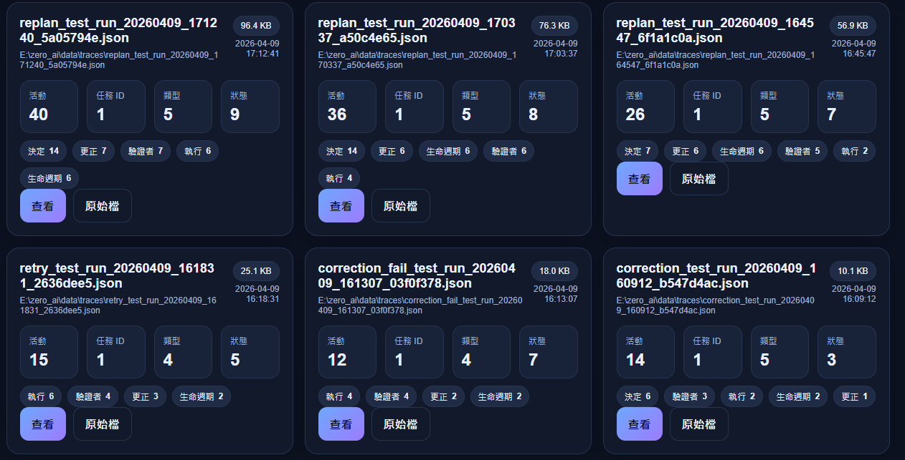
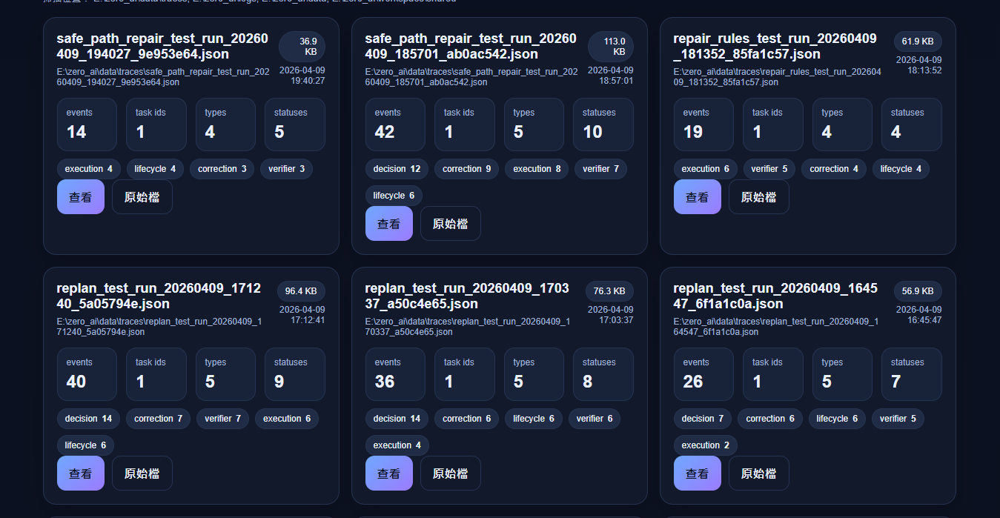
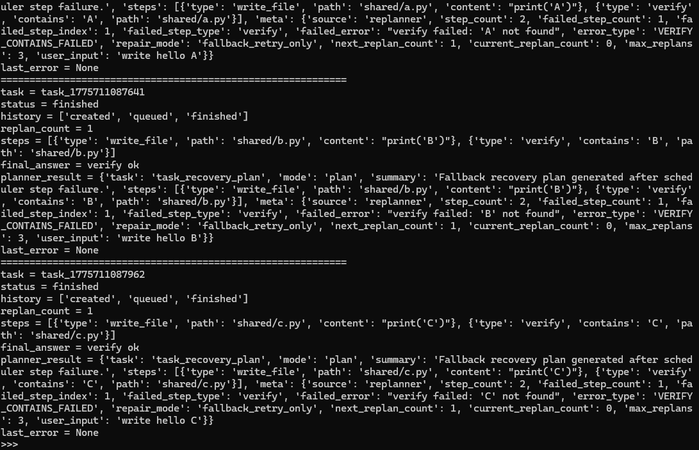

# ZERO_AI

A local-first AI agent system that executes tasks, handles failures, and keeps going.

---

## What makes it different?

ZERO_AI is not just a chatbot.

It is designed to:
- execute real tasks
- detect failures during execution
- attempt repair and retry automatically

This creates a basic execution loop with self-healing capability.

---

## What is this?

ZERO_AI is an experimental system that tries to go beyond chat.

Instead of just answering, it:
- plans tasks
- executes steps
- handles failures
- and tries to fix itself

---

## Core Capabilities

- Task planning and execution
- Multi-step workflow (DAG-like structure)
- Self-healing (automatic retry and repair)
- Execution tracing and logs

---

## Example Flow

1. Receive a task
2. Break into steps
3. Execute step-by-step
4. Detect failure
5. Attempt repair
6. Continue until completion

---

## Demo

### 1. Agent Loop Overview

### 2. Safe Path Repair

### 3. Multi-task Self-healing

---

## Current Status

This is an active work-in-progress system.

Focus areas:
- stability
- execution reliability
- real-world use cases

---

## Contact

Open an issue if you want to discuss or collaborate.
