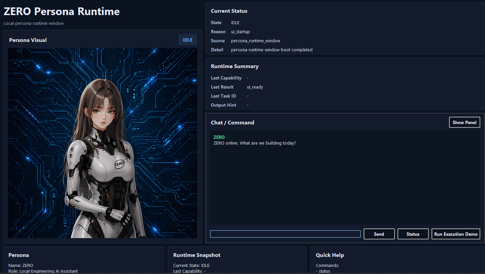
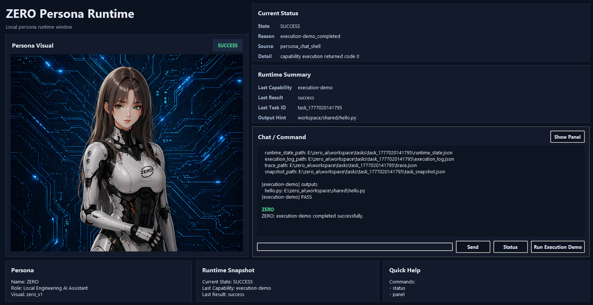

# ZERO AI

A local-first AI engineering agent that turns requirements into executable results.

**Requirement → Planning → Code → Execution → Verification**

ZERO is not a chatbot.  
It is a system that builds and runs solutions.

---

## 🔧 Core Showcase

### 🚀 Mini Build Agent (Primary Demo)

```bash
python main.py mini-build-demo
```

This demo shows a complete engineering loop:

- read a requirement document  
- generate planning outputs  
- generate Python code  
- execute the generated script  
- write result artifacts  
- verify the final output  

### 📦 Output Artifacts

- workspace/shared/project_summary.txt  
- workspace/shared/implementation_plan.txt  
- workspace/shared/acceptance_checklist.txt  
- workspace/shared/number_stats.py  
- workspace/shared/stats_result.txt  

### ✅ What this proves

- not just text generation  
- real file outputs  
- code generation + execution  
- result verification  

📂 Demo assets:  
demos/08_mini_build_demo/

---

## 📦 Additional Demo

### Requirement Demo

```bash
python main.py requirement-demo
```

Demonstrates:

- requirement input  
- planning output  
- multi-artifact generation  
- result inspection  

### Output Artifacts

- workspace/shared/project_summary.txt  
- workspace/shared/implementation_plan.txt  
- workspace/shared/acceptance_checklist.txt  

📂 Demo assets:  
demos/07_requirement_demo/


---

## 🖥️ Persona Runtime Window

ZERO also includes a local Persona Runtime window for showing runtime state through a visual UI.

This window is not only a character display. It shows:

- current runtime state
- command/chat interaction
- execution-demo result
- task artifact paths
- runtime summary and output hints

### Visual Ready



### Execution Demo Success



### What this proves

- the UI is connected to runtime state
- execution-demo can update the persona status to SUCCESS
- output artifacts such as `workspace/shared/hello.py` are surfaced in the UI
- task IDs and execution traces are visible for inspection

---

## ⚙️ Capabilities

- Requirement understanding  
- Planning system (planning pack)  
- Code generation  
- Tool execution  
- Output verification  
- Task lifecycle control  
- Controlled AgentLoop observe-decide-act loop  
- Safe loop execution through `task loop <task_id> [max_cycles]`  
- Artifact visibility  

---

## 🧠 What makes this different

This is not an LLM wrapper.

ZERO:

- executes tasks, not just responds  
- produces real artifacts (code, files)  
- exposes runtime state  
- verifies outputs through execution  

It demonstrates a **complete engineering agent loop**.

---

## 🚀 Quick Start

### Show help
```bash
python main.py help
```

### Check runtime
```bash
python main.py runtime
```

### Run validation
```bash
python main.py smoke
```

### Run demos
```bash
python main.py doc-demo
python main.py requirement-demo
python main.py execution-demo
python main.py mini-build-demo
```

---

## 🧱 Core CLI

```bash
python app.py runtime
python app.py health
python app.py task list
python app.py task show <task_id>
python app.py task result <task_id>
python app.py task loop <task_id> [max_cycles]
```

### Document tasks

```bash
python app.py task doc-summary input.txt summary.txt
python app.py task doc-action-items input.txt action_items.txt
```

---

## 🔁 Controlled AgentLoop Loop

ZERO now includes a controlled minimal AgentLoop path:

```bash
python app.py task loop <task_id> [max_cycles]
```

This path is intentionally explicit. It does not replace the default scheduler or `task run` behavior.

It supports a safe observe-decide-act cycle:

- observe current task/runtime result
- decide whether to finish, continue, replan, fail, or stop on guard/block conditions
- run the next tick only when the decision is `continue`
- stop safely on `finish`, `replan`, `fail`, `blocked`, or `max_cycles_reached`

### What this proves

- AgentLoop can now record observe/decide metadata
- task loop execution can run until terminal state under a max-cycle guard
- CLI access is controlled through an explicit command
- default task execution remains unchanged

---

## 🏗️ System Structure

- main.py → unified entrypoint  
- app.py → core CLI  
- core/planning/ → planner  
- core/runtime/ → execution layer  
- core/tasks/ → scheduler + lifecycle  
- tests/ → validation  
- demos/ → showcase assets  
- docs/ → devlog + checkpoints  

---

## 📊 Current Position

ZERO is:

- local-first  
- execution-oriented  
- artifact-producing  
- inspectable  
- reproducible  

Not optimized yet for:

- polished UI  
- one-click install  
- mass users  

---

## 📌 One-line Summary

ZERO is a local-first engineering agent that can turn requirements into executable, verifiable results through a controllable task system.
