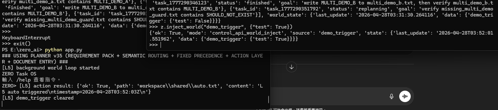
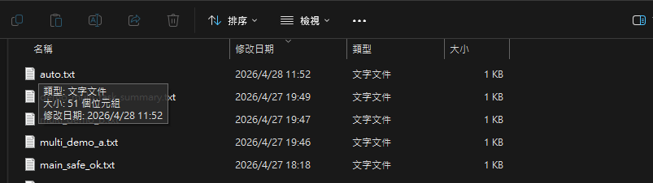
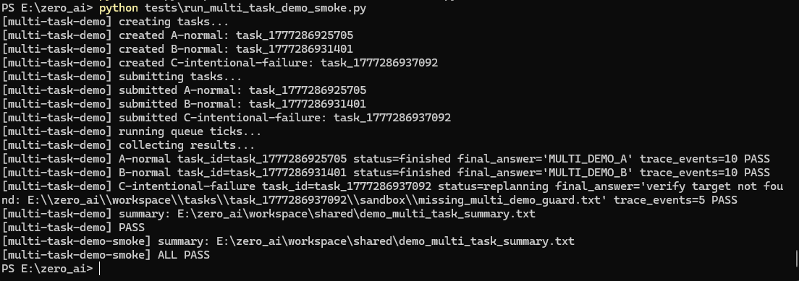
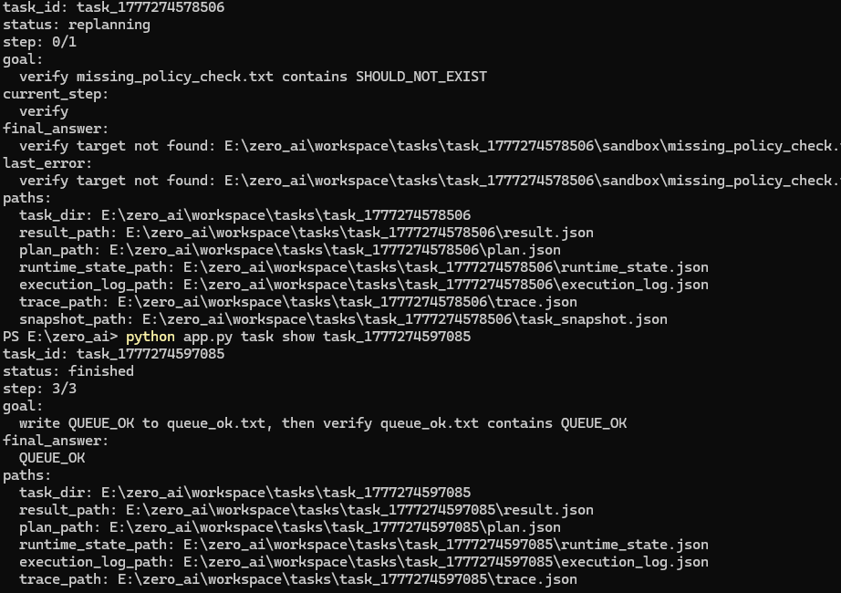

# ZERO AI

ZERO is a local-first autonomous engineering system.

It does not just respond.  
It observes, decides, executes, writes files, and preserves evidence.

**Requirement → Planning → Execution → Verification → Autonomous Loop**

ZERO is not a chatbot wrapper.  
It is a controllable local agent platform for engineering workflows.

---

## Current Highlight: L5 Autonomous Execution

ZERO now includes a minimal autonomous world loop:

```text
external event → world_state → background observe loop → action → real file output
```

This means ZERO can react to external state without manual CLI input.

### Evidence Pack

The current L5 evidence pack is stored under:

```text
docs/demo_assets/
```

Recommended assets:

```text
l5_control_api_world_trigger_result.png
l5_auto_output_file_updated.png
l5_control_api_task_execution_trace.png
l5_auto_output_sample.txt
```

### What this proves

- external events can be injected through the platform control API
- ZERO detects world_state changes in a background loop
- ZERO performs an action automatically
- a real output file is written to disk
- the trigger is cleared after execution
- execution can be inspected through task/runtime artifacts

### Main Screenshot



### Output File Proof



Sample output:

```text
L5 auto triggered
timestamp=2026-04-28T03:52:03Z
```

---

## Platform Control API

ZERO now exposes a small platform-facing API:

```python
from core.control.control_api import Zero

z = Zero()

z.get_status()
z.inject_world("demo_trigger", {"test": True})
z.submit("Create a task that writes hello to workspace/shared/api.txt")
```

This API is the first step toward making ZERO usable as a platform instead of only a CLI tool.

### Current API capabilities

- boot the ZERO system
- inspect runtime/task status
- inject world_state events
- submit semantic tasks
- access task state
- bridge external scripts/tools into ZERO

---

## Core Showcase: Mini Build Agent

```bash
python main.py mini-build-demo
```

This demo shows a complete engineering loop:

- read a requirement document
- generate planning outputs
- generate Python code
- execute the generated script
- write result artifacts
- verify the final output

### Output Artifacts

```text
workspace/shared/project_summary.txt
workspace/shared/implementation_plan.txt
workspace/shared/acceptance_checklist.txt
workspace/shared/number_stats.py
workspace/shared/stats_result.txt
```

### What this proves

- not just text generation
- real file outputs
- code generation and execution
- result verification

Demo assets:

```text
demos/08_mini_build_demo/
```

---

## Requirement Demo

```bash
python main.py requirement-demo
```

Demonstrates:

- requirement input
- planning output
- multi-artifact generation
- result inspection

### Output Artifacts

```text
workspace/shared/project_summary.txt
workspace/shared/implementation_plan.txt
workspace/shared/acceptance_checklist.txt
```

Demo assets:

```text
demos/07_requirement_demo/
```

---

## Persona Runtime Window

ZERO includes a local Persona Runtime window for showing runtime state through a visual UI.

This window is not only a character display. It shows:

- current runtime state
- command/chat interaction
- execution-demo result
- task artifact paths
- runtime summary and output hints

### Visual Ready


### Execution Demo Success


### What this proves

- the UI is connected to runtime state
- execution-demo can update the persona status to SUCCESS
- output artifacts such as `workspace/shared/hello.py` are surfaced in the UI
- task IDs and execution traces are visible for inspection

---

## Capabilities

- local-first runtime
- requirement understanding
- planning system
- code generation
- tool execution
- output verification
- task lifecycle control
- background world_state observe loop
- platform control API
- controlled AgentLoop observe-decide-act path
- artifact visibility
- runtime trace inspection

---

## What Makes ZERO Different

ZERO is not an LLM wrapper.

ZERO:

- executes tasks, not just responds
- produces real artifacts
- exposes runtime state
- verifies outputs through execution
- can react to external world_state events
- is structured as a local platform core, not a single-purpose demo

It demonstrates a complete engineering agent loop with a path toward autonomous platform behavior.

---

## Quick Start

### Show help

```bash
python main.py help
```

### Check runtime

```bash
python main.py runtime
```

### Run validation

```bash
python main.py smoke
```

### Run demos

```bash
python main.py doc-demo
python main.py requirement-demo
python main.py execution-demo
python main.py mini-build-demo
```

---

## Core CLI

```bash
python app.py runtime
python app.py health
python app.py task list
python app.py task show <task_id>
python app.py task result <task_id>
python app.py task loop <task_id> [max_cycles]
```

### Document tasks

```bash
python app.py task doc-summary input.txt summary.txt
python app.py task doc-action-items input.txt action_items.txt
```

---

## Controlled AgentLoop Loop

ZERO includes a controlled minimal AgentLoop path:

```bash
python app.py task loop <task_id> [max_cycles]
```

This path is intentionally explicit. It does not replace the default scheduler or `task run` behavior.

It supports a safe observe-decide-act cycle:

- observe current task/runtime result
- decide whether to finish, continue, replan, fail, or stop on guard/block conditions
- run the next tick only when the decision is `continue`
- stop safely on `finish`, `replan`, `fail`, `blocked`, or `max_cycles_reached`

### What this proves

- AgentLoop records observe/decide metadata
- task loop execution can run until terminal state under a max-cycle guard
- CLI access is controlled through an explicit command
- default task execution remains unchanged

---

## Multi-task Demo

ZERO includes a repeatable multi-task demo scenario:

```bash
python tests/run_multi_task_demo_smoke.py
```

This demo creates three tasks:

- one normal task that writes and verifies `MULTI_DEMO_A`
- one normal task that writes and verifies `MULTI_DEMO_B`
- one intentionally failing verification task

The expected result is that the two normal tasks finish successfully while the intentional failure moves into a safe repair state without blocking the queue.



### What this proves

- multiple tasks can be queued and advanced together
- normal tasks can finish even when another task fails or replans
- each task has observable trace evidence
- the demo is repeatable through smoke validation

Engineering proof for the queue policy is also kept here:



---

## System Structure

```text
main.py                 unified entrypoint
app.py                  core CLI + background world loop
core/control/           platform control API
core/world/             world_state layer
core/planning/          planner
core/runtime/           execution layer
core/tasks/             scheduler + lifecycle
tests/                  validation
demos/                  showcase assets
docs/                   devlog + checkpoints
docs/demo_assets/       demo evidence assets
```

---

## Current Engineering Checkpoint

ZERO's current mainline has a runtime-safe multi-task execution baseline.

Validated mainline capabilities include:

- normalized handler results
- observable local traces with `step_start`, `step_result`, and `task_finished`
- task-local trace ticks for cleaner inspection
- queue readiness rules that prevent `created` tasks from running before submit
- multi-task queue progression without failed/replanning tasks blocking normal tasks
- runtime artifact safety guards to prevent oversized `runtime_state.json` / `result.json` growth
- command safety guard against self-invoking task commands such as `python app.py task run ...`
- L5 background world_state loop through `app.py`
- platform-facing `control_api.py`

Latest regression proof:

```bash
python app.py task create "write MAIN_SAFE_OK to main_safe_ok.txt, then verify main_safe_ok.txt contains MAIN_SAFE_OK"
python app.py task submit <task_id>
python app.py task run 1
python app.py task run 1
python app.py task run 1
python app.py task show <task_id>
```

Confirmed result:

- task reached `finished`
- step progress reached `3/3`
- final answer: `MAIN_SAFE_OK`

---

## Current Position

ZERO is:

- local-first
- execution-oriented
- artifact-producing
- inspectable
- reproducible
- platform-oriented
- ready for controlled external event integration

Not optimized yet for:

- polished UI
- one-click install
- mass users

---

## Recommended Next Step

The next high-value platform step is a file watcher event source:

```text
drop file into watched folder
→ emit world_state event
→ ZERO detects event
→ task runs automatically
→ result file is written
```

This will make the platform value easier to understand than manual world_state injection.

---

## One-line Summary

ZERO is a local-first autonomous engineering platform that can turn requirements and external events into executable, verifiable results.
