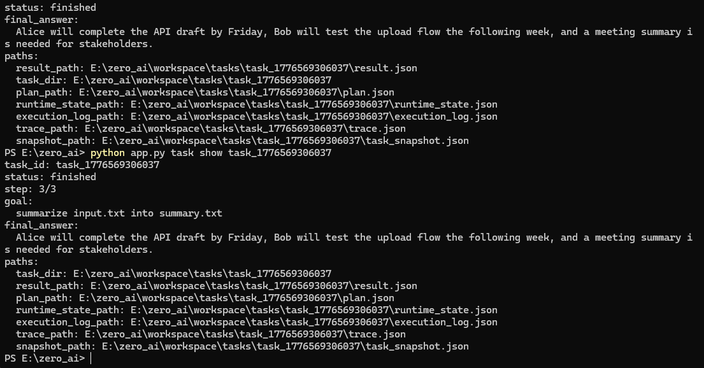
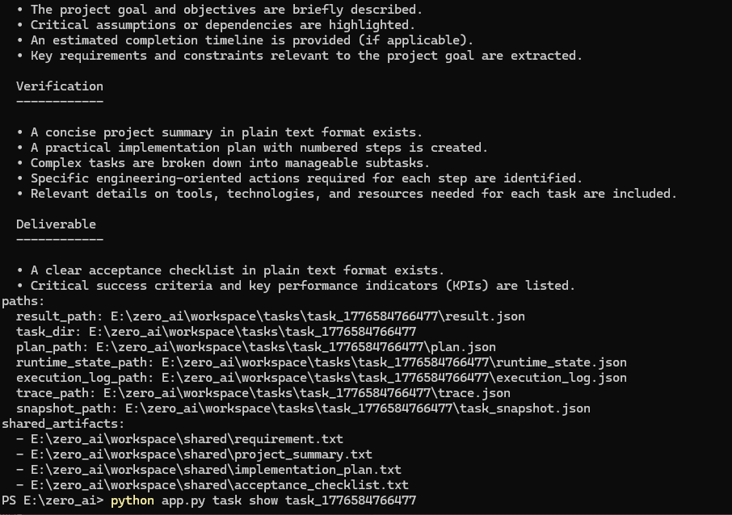
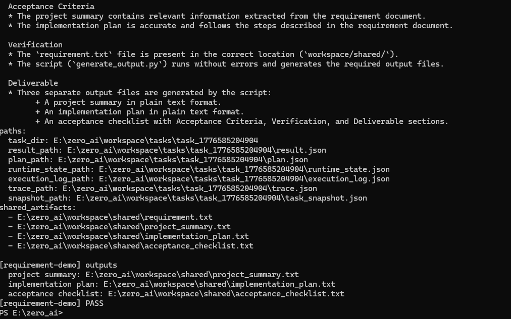
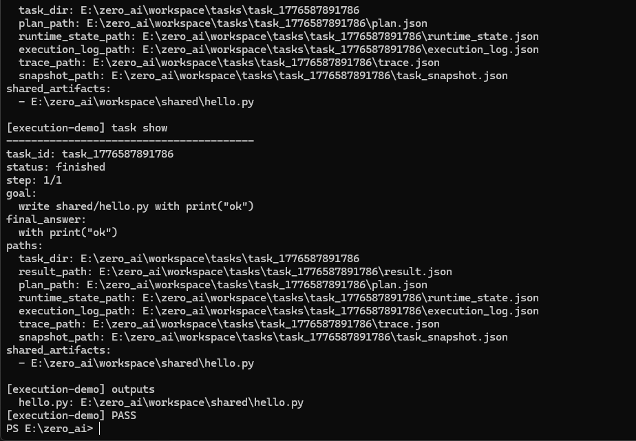

# ZERO

ZERO is a local-first engineering agent system focused on controllable task execution, inspectable runtime state, and verifiable artifact-producing workflows.

This project is not being positioned as a polished consumer chatbot.  
It is being built as an engineering-first agent runtime where task flow, execution state, results, and artifacts can be inspected directly instead of disappearing into a black box.

---

## Tagline

**A local-first engineering agent with controllable task flow, inspectable runtime behavior, and a unified operational entrypoint.**

---

## What ZERO Is

ZERO is currently best understood as:

- a local-first task-and-agent runtime
- a controllable CLI surface for task creation, execution, inspection, and validation
- an execution stack with repeatable smoke validation
- an engineering-oriented system where artifacts, runtime state, and result paths are visible

The current emphasis is on:

- controllable execution
- artifact-producing task workflows
- runtime visibility
- repeatable validation
- clear operator-facing entrypoints
- mainline stability before broader expansion

---

## Current Release Checkpoint

This repository has now reached a stronger engineering checkpoint with the following properties:

- document tasks work through the official task lifecycle
- explicit document-task CLI entry is available
- `task result` and `task show` expose shared artifacts
- document-task smoke validation exists
- stable mainline smoke validation exists
- AgentLoop `run(...)` compatibility has been restored
- runtime smoke is passing again
- a unified entrypoint exists through `main.py`
- a second representative scenario now exists through requirement-pack delivery flow
- a third representative scenario now exists through execution-proof flow

This means the current version is already suitable for:

- engineering demos
- checkpoint validation
- runtime inspection
- repeatable smoke verification
- operator-facing task execution demonstrations

---

## Unified Entry Point

The repository now includes a unified outer entrypoint:

```bash
python main.py help
```

Supported commands:

```bash
python main.py start
python main.py runtime
python main.py smoke
python main.py doc-demo
python main.py requirement-demo
python main.py execution-demo
python main.py health
```

### What each command does

- `start`  
  Launch interactive ZERO CLI.

- `runtime`  
  Show runtime information, including current plugin / model configuration.

- `smoke`  
  Run stable mainline smoke validation.

- `doc-demo`  
  Run the end-to-end document demo flow through the real task system.

- `requirement-demo`  
  Run the requirement-to-delivery-pack demo flow.

- `execution-demo`  
  Run the execution-proof demo flow.

- `health`  
  Show health information.

This means the project no longer depends only on scattered internal commands for demonstration.  
It now has a cleaner shell for runtime inspection, smoke validation, and representative demo execution.

---

## Quick Start

### 1. Show help

```bash
python main.py help
```

### 2. Check runtime

```bash
python main.py runtime
```

### 3. Run stable mainline smoke validation

```bash
python main.py smoke
```

### 4. Run the document demo

```bash
python main.py doc-demo
```

Run a complete document-task lifecycle demo:

- create task
- submit
- execute
- inspect result
- inspect shared artifacts

Expected outputs:

- `workspace/shared/summary_demo.txt`
- `workspace/shared/action_items_demo.txt`

### 5. Run the requirement-pack demo

```bash
python main.py requirement-demo
```

Run a requirement-to-delivery-pack lifecycle demo:

- submit
- execute
- generate multiple artifacts
- inspect result
- inspect task state

Expected outputs:

- `workspace/shared/project_summary.txt`
- `workspace/shared/implementation_plan.txt`
- `workspace/shared/acceptance_checklist.txt`

### 6. Run the execution-proof demo

```bash
python main.py execution-demo
```

Run a complete task lifecycle demo:

- submit
- execute
- artifact generation
- result inspection

Expected output:

- `workspace/shared/hello.py`

### 7. Start interactive mode

```bash
python main.py start
```

---

## Core CLI Surface

The core task / agent CLI remains in `app.py`.

Examples:

```bash
python app.py runtime
python app.py health
python app.py task list
python app.py task show <task_id>
python app.py task result <task_id>
```

Document-task commands:

```bash
python app.py task doc-summary input.txt summary_cli.txt
python app.py task doc-action-items input.txt action_items_cli.txt
```

Requirement-pack command:

```bash
python app.py task requirement-pack requirement.txt
```

Execution-proof command:

```bash
python app.py task execution-proof
```

These explicit commands create official tasks through the normal task lifecycle instead of relying only on free-form natural-language task goals.

---

## What Is Working Now

### 1. Official document-task mainline integration

Document workflows now work through the official task lifecycle:

- `task create`
- `task submit`
- `task run`
- `task result`
- `task show`

Validated document goals include:

```bash
python app.py task create "summarize input.txt into summary.txt"
python app.py task create "read input.txt and extract action items into action_items.txt"
```

### 2. Explicit document-task CLI entry

```bash
python app.py task doc-summary input.txt summary_cli.txt
python app.py task doc-action-items input.txt action_items_cli.txt
```

### 3. Shared artifact visibility

For completed tasks, both:

- `task result <task_id>`
- `task show <task_id>`

now expose shared-scope artifacts in addition to task-local runtime files.

This improves operator clarity because the system now surfaces real outputs such as:

- `workspace/shared/summary.txt`
- `workspace/shared/action_items.txt`
- `workspace/shared/project_summary.txt`
- `workspace/shared/implementation_plan.txt`
- `workspace/shared/acceptance_checklist.txt`
- `workspace/shared/hello.py`

instead of only task-local JSON/runtime records.

### 4. Runtime validation recovery

`tests/test_agent_loop.py` and `tests/run_runtime_smoke.py` are passing again after restoring `AgentLoop.run(...)` compatibility.

### 5. Stable mainline smoke

The repository now has a stable mainline smoke runner through:

```bash
python tests/run_mainline_smoke.py
```

and via the unified entrypoint:

```bash
python main.py smoke
```

### 6. End-to-end document demo

The unified entrypoint can run a real document demo through:

```bash
python main.py doc-demo
```

This demo:

- prepares input under `workspace/shared/`
- creates official tasks
- submits and runs them
- waits for completion
- prints task results
- confirms shared output artifact locations

### 7. Requirement → Delivery Pack scenario

The unified entrypoint can now run a second representative scenario through:

```bash
python main.py requirement-demo
```

This flow:

- prepares `workspace/shared/requirement.txt`
- creates an official requirement-pack task
- runs the task through lifecycle execution
- generates multiple delivery artifacts
- verifies acceptance checklist structure
- exposes outputs through `task result` / `task show`

The requirement-pack flow currently generates:

- `workspace/shared/project_summary.txt`
- `workspace/shared/implementation_plan.txt`
- `workspace/shared/acceptance_checklist.txt`

This is the current second representative scenario because it shows that ZERO can turn a requirement document into a multi-artifact delivery package instead of only summarizing a file.

### 8. Execution Proof Task scenario

The unified entrypoint can now run a third representative scenario through:

```bash
python main.py execution-demo
```

This flow:

- creates an execution-proof task through explicit CLI entry
- writes a real artifact to shared workspace
- verifies the artifact content
- exposes the finished task through `task result` / `task show`

The execution-proof flow currently generates:

- `workspace/shared/hello.py`

This is the current third representative scenario because it shows that ZERO can perform a minimal engineering execution task with artifact output and verification instead of only producing document-style text outputs.

---

## Validation Layers

### Stable mainline validation

```bash
python main.py smoke
```

Equivalent direct path:

```bash
python tests/run_mainline_smoke.py
```

Stable mainline smoke currently includes:

- tool-layer smoke
- scheduler smoke
- document-task smoke

### Runtime validation

```bash
python tests/run_runtime_smoke.py
```

### Document-task smoke

```bash
python tests/run_document_task_smoke.py
```

This validates both:

- summary flow
- action-items flow

with real artifact generation under `workspace/shared/`.

---

## Demo Flows

### Demo Flow A — Runtime inspection

```bash
python main.py runtime
```

### Demo Flow B — Stable validation

```bash
python main.py smoke
```

### Demo Flow C — End-to-end document demo

```bash
python main.py doc-demo
```

This is the clearest single-file-processing demo because it shows:

- unified entrypoint
- task lifecycle execution
- finished task results
- artifact paths
- shared output files
- repeatable validation style

### Demo Flow D — Requirement to Delivery Pack

```bash
python main.py requirement-demo
```

This is the current best multi-artifact demo because it shows:

- requirement-driven task creation
- lifecycle execution
- multiple generated artifacts
- checklist-oriented verification
- shared artifact visibility
- result/show-based inspection

### Demo Flow E — Execution Proof Task

```bash
python main.py execution-demo
```

Demonstrates:

- task submission
- execution
- artifact generation
- result inspection

This is the current simplest engineering-execution demo because it shows:

- explicit execution task entry
- lifecycle execution
- real file generation
- shared artifact visibility
- minimal verification
- result/show-based inspection

---

## Why the Current Architecture Matters

The current repository is not trying to hide execution complexity.

Instead, it is explicitly moving toward a system where an operator can see:

- what task was created
- what state the task is in
- what result was produced
- what artifact paths exist
- what smoke validations pass
- where runtime failures occur

That is important because the current goal is not just “generate a response.”  
The goal is to build a local-first agent execution system that can support reliable engineering workflows.

---

## Evidence / Checkpoints

Relevant checkpoint images are kept under:

```text
docs/images/checkpoints/
```

### Primary engineering checkpoint

The strongest single checkpoint image right now is the summary mainline result/show capture:



This image is important because it shows, in one place:

- finished task state
- `task result` visibility
- `task show` visibility
- task path visibility
- shared artifact visibility

### Requirement-pack checkpoint

The strongest checkpoint for the second representative scenario is the requirement demo pass capture:



This image is important because it shows:

- requirement-demo completion
- generated delivery artifacts
- shared artifact visibility
- unified entrypoint proof through `[requirement-demo] PASS`

### Requirement-pack task inspection checkpoint

The engineering evidence companion image for that scenario is the task-show capture:



This image is useful because it shows:

- acceptance checklist content
- task/runtime path visibility
- shared artifact visibility
- inspectable task-show output for the requirement-pack flow

### Execution-proof checkpoint

The strongest checkpoint for the third representative scenario is the execution demo pass capture:



This image is important because it shows:

- execution-demo completion
- generated `hello.py` artifact
- shared artifact visibility
- unified entrypoint proof through `[execution-demo] PASS`

Verified via runtime and mainline smoke validation.

### Additional checkpoint images

- `checkpoint_task_result_action_items_finished.png`
- `checkpoint_task_result_action_items_mainline.png`
- `checkpoint_task_result_and_show_summary_mainline.png`
- `checkpoint_requirement_demo_pass.png`
- `checkpoint_requirement_pack_task_show.png`
- `checkpoint_execution_demo_pass.png`

These are useful for README support, devlog proof, demo material, and future public-facing checkpoint presentation because they show:

- CLI invocation
- finished task state
- final answer visibility
- task path visibility
- shared artifact visibility
- task result / task show inspection
- representative scenario completion

---

## Repository Orientation

Key areas in the current repository include:

- `main.py` — unified outer entrypoint for runtime / smoke / demos
- `app.py` — core CLI and task surface
- `core/planning/` — planner / replanner layer
- `core/runtime/` — runtime execution layer
- `core/tasks/` — scheduler, task persistence, task lifecycle
- `core/system/llm_planner.py` — deterministic + LLM planning bridge
- `tests/` — smoke tests and validation scripts
- `docs/devlog.md` — engineering progress records
- `docs/images/checkpoints/` — checkpoint evidence images

---

## Current Positioning

ZERO is currently best described as:

**A local-first engineering agent system with a controllable task lifecycle, visible artifacts, repeatable smoke validation, and a unified operational entrypoint.**

It is optimized right now for:

- engineering clarity
- local execution
- runtime inspection
- stable checkpoints
- task/result/artifact visibility
- validation before broader expansion

It is not yet primarily optimized for:

- polished consumer UX
- mass onboarding
- broad workflow packaging
- sensor integration
- one-click installer-grade distribution

The current “one-click” work is at the engineering-entrypoint stage, not final packaged deployment.

---

## Current State in One Sentence

This version is now strong enough to demo, validate, inspect, and explain through a unified entrypoint with multiple representative scenarios instead of only through scattered internal commands.

---

## Notes

The current repository should still be read as an engineering checkpoint, not as a finished mass-market product.

What matters most right now is that ZERO is becoming:

- more controllable
- more inspectable
- more reproducible
- more demo-ready
- less dependent on hidden internal flows
