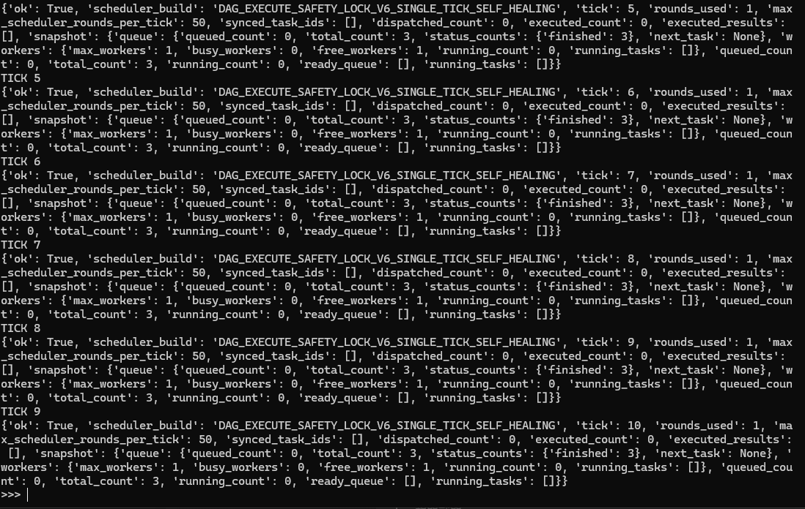
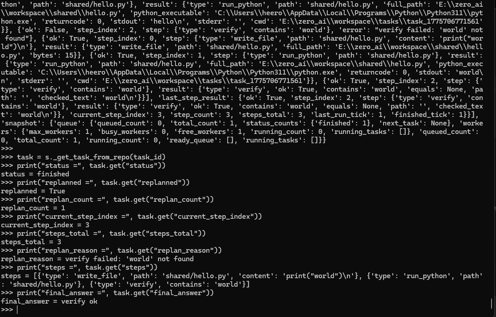
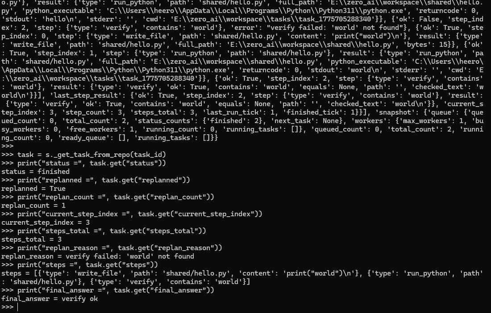
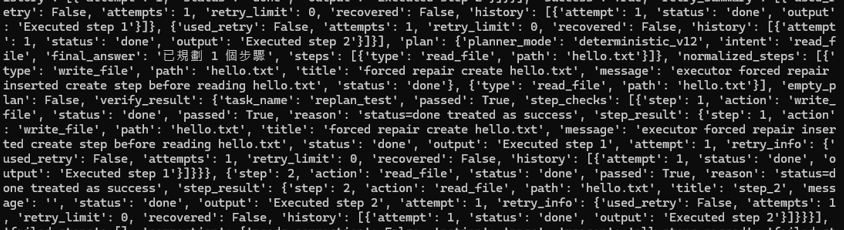

# ZERO AI

Autonomous Multi-Task AI System with Self-Healing Execution

---

## Overview

ZERO is a local-first autonomous agent system designed to execute complex tasks through structured planning, execution, verification, and correction.

It is not just a chatbot or script runner.

ZERO operates as a **self-correcting execution system** that can:

- Execute multi-step tasks
- Detect failures through verification
- Retry or replan when needed
- Automatically repair invalid execution plans
- Converge to a successful result through iterative loops

---

## Core Loop

Plan → Execute → Verify → Correct → Retry / Replan → Re-execute

This is the foundation of ZERO.

---

## What ZERO Can Do

ZERO already supports:

- multi-step task execution  
- verification-driven correction  
- retry  
- replanning  
- executor-level forced repair  

In practice, that means the system can:

- run structured tasks
- detect failures through verification
- retry when the failure is recoverable
- replan when retry is not enough
- repair invalid plans before execution

---

## Why ZERO

Most AI systems assume:

Plan → Execute → Done

ZERO assumes:

Plan may be wrong  
Execution may fail  
System must adapt  

---

## Demo

### Multi Task Execution

---

### Scheduler Execution

---

### Self-Healing Execution Flow

---

### Verification + Repair

---

## Agent Loop Trace & Self-Correction

### Agent Loop Trace Overview

This trace shows:

- decision making
- execution steps
- verification
- correction
- replanning cycles

ZERO is not executing linearly — it iterates toward success.

---

### Executor-Level Forced Repair

When the planner produces an invalid plan:

read hello.txt

The executor repairs it into:

create hello.txt → read hello.txt

This prevents failure and allows the system to converge.

---

## Current Status

ZERO currently has:

- multi-step execution
- verification-driven correction
- retry + replanning loop
- executor-level forced repair
- trace visibility

At this stage, ZERO is already a **self-correcting agent runtime**, not just a script pipeline.

---

## License

MIT License
