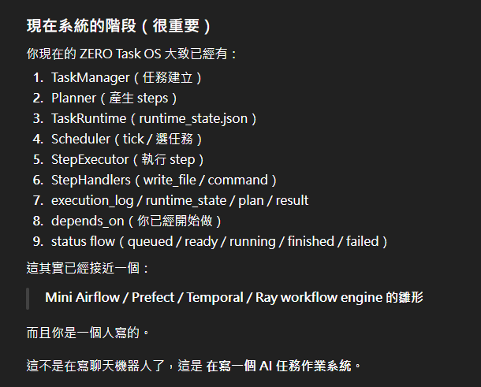

# ZERO Current Status

## Current Runtime Modules

## Current Stage

ZERO is currently at the stage where its **Task Runtime core** has taken shape.

It is no longer just a local chat shell or a simple tool-calling demo.

At this stage, ZERO already has the core structure of a mini Task OS / Agent Runtime prototype.

---

## Main Components Already Present

### 1. TaskManager
Responsible for task creation and task registration.

### 2. Planner
Responsible for generating executable steps from user intent.

Current planner direction includes deterministic multi-step planning behavior.

### 3. TaskRuntime
Responsible for runtime state and lifecycle management.

### 4. Scheduler
Responsible for scheduler tick and selecting runnable tasks.

### 5. StepExecutor
Responsible for executing step-by-step task actions.

### 6. StepHandlers
Execution handlers for step types such as:
- write_file
- command
- read_file
- tool
- respond
- llm

### 7. Workspace System
Includes:
- task-local workspace
- sandbox
- shared workspace

### 8. Execution Artifacts
The system already uses structured files such as:
- `plan.json`
- `runtime_state.json`
- `execution_log.json`
- `result.json`
- `tasks.json`

### 9. Status Flow
Current runtime flow already includes states such as:
- queued
- ready
- running
- finished
- failed

### 10. Dependency Field Foundation
Fields such as `depends_on` are already present in the runtime model, forming a base for future dependency scheduling.

---

## What Has Already Been Demonstrated

The system has already demonstrated successful task behavior such as:

- creating a file
- executing a generated script
- reading task-local files
- recording execution logs
- updating runtime state
- marking tasks as finished
- storing outputs in task workspace
- beginning to support shared workspace behavior

---

## Example Verified Runtime Behavior

A typical successful task currently demonstrates:

1. user submits task
2. planner generates steps
3. plan is written to `plan.json`
4. runtime creates task workspace
5. step executor runs the step(s)
6. `execution_log.json` records step success
7. `result.json` is produced
8. `runtime_state.json` reflects lifecycle transitions
9. task status becomes `finished`

This means the core runtime loop is already real and verifiable.

---

## Current Architectural Identity

At the current stage, ZERO is best described as:

- local-first task runtime
- step-based execution engine
- agent runtime prototype
- mini task orchestration system
- mini Task OS prototype

It is not yet a full platform, but it is already beyond the demo-only stage.

---

## Current Strengths

### State-centric execution
State is written to files and can be inspected.

### Workspace-based execution
Each task has its own task workspace and sandbox.

### Verifiable execution
Tasks produce logs, outputs, and runtime state.

### Planner-first model
Execution is not only prompt-driven; it is plan-driven.

### Extensible executor model
Step handlers make future expansion easier.

---

## What Is Still In Progress

The following areas are still under active development or expansion:

- queue system
- priority handling
- retry loop
- replan loop
- stronger dependency scheduling
- DAG-like workflow behavior
- dashboard / web UI
- richer CLI task management
- plugin/tool ecosystem
- multi-worker execution

---

## Practical Interpretation

If judged by engineering system maturity, ZERO is now somewhere between:

- agent runtime
and
- workflow engine prototype

This means the project is no longer just proving "an AI can call a tool."

It is now proving "an execution system can manage AI-driven tasks through runtime state, workspaces, and lifecycle control."

---

## Summary

Current ZERO status can be summarized as:

- planner exists
- runtime exists
- scheduler exists
- executor exists
- workspace exists
- state exists
- logs exist
- result files exist
- lifecycle exists

This is a strong foundation for the next stage:
**queue / retry / dependency / DAG / orchestration expansion**.
