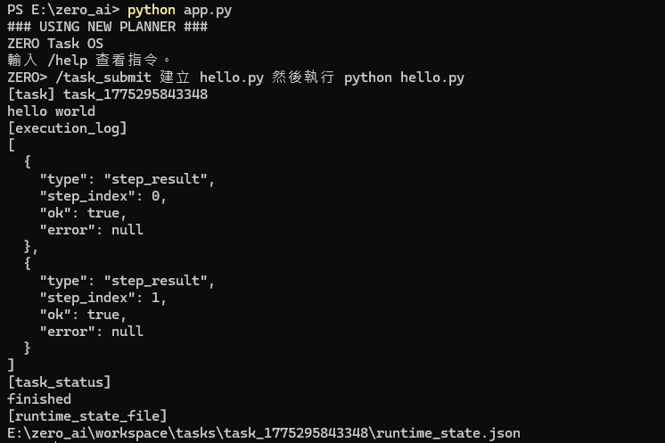
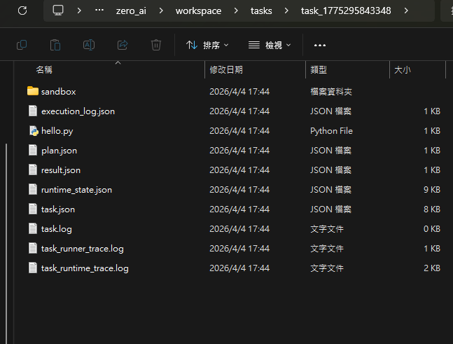

# ZERO Demo

## Overview

This document shows practical examples of ZERO running as a task-oriented execution system.

The goal of these demos is not just to show that ZERO can print output.

The goal is to show that ZERO can:
- receive a task
- generate steps
- create a workspace
- execute steps
- record logs
- update runtime state
- produce a result
- finish the task lifecycle

---

## Demo 1 — CLI Task Execution

Run the system:

```bash
python app.py
```

Submit a task:

```bash
/task_submit 建立 hello.py 然後執行 python hello.py
```

Example output:

```text
[task] task_1775295843348
hello world

[execution_log]
[
  {
    "type": "step_result",
    "step_index": 0,
    "ok": true,
    "error": null
  },
  {
    "type": "step_result",
    "step_index": 1,
    "ok": true,
    "error": null
  }
]

[task_status]
finished
```

Image:



### What this demo proves
This demo proves that ZERO can:

- accept a task from CLI
- generate a multi-step plan
- execute the steps
- record step results
- complete task lifecycle
- return a final finished status

---

## Demo 2 — Task Workspace Structure

A typical task workspace looks like this:

```text
workspace/
  tasks/
    task_xxx/
      sandbox/
      execution_log.json
      hello.py
      plan.json
      result.json
      runtime_state.json
      task.json
      task.log
      task_runner.trace.log
      task_runtime.trace.log
```

Image:



### What this demo proves
This demo proves that ZERO uses a structured task workspace model with:

- task-local sandbox
- explicit planner output
- explicit runtime state
- execution history
- result artifacts
- task metadata
- task logs and traces

This is one of the main reasons ZERO is better described as a runtime system than a simple chatbot demo.

---

## Demo 3 — Example Task Lifecycle

A successful file creation task can look like this:

- goal: create `api.py`
- planner generates 1 `write_file` step
- step executor executes `write_file`
- file is written to `sandbox/api.py`
- runtime state flows through:
  - `queued`
  - `ready`
  - `running`
  - `finished`
- `execution_log.json` confirms successful execution

### What this demo proves
This demonstrates:
- planner-to-executor continuity
- verifiable runtime state transitions
- file output inside task sandbox
- inspectable execution artifacts

---

## Demo 4 — Path Resolution Rules

ZERO is moving toward explicit path resolution behavior.

Examples:

```text
shared/a.py
→ workspace/shared/a.py

sandbox/a.py
→ workspace/tasks/<task_id>/sandbox/a.py

a.py
→ workspace/tasks/<task_id>/sandbox/a.py

../xxx
→ rejected
```

### What this demo proves
This demonstrates:
- workspace boundary policy
- shared vs task-local file routing
- default sandbox behavior
- path traversal protection

This is critical for building a safe and predictable task execution runtime.

---

## Why These Demos Matter

These demos are not just small examples.

Together, they show that ZERO already has:

- task submission
- planning
- runtime state
- step execution
- workspace isolation
- shared workspace direction
- logging
- result output
- lifecycle completion

This moves ZERO beyond:
- prompt demo
- tool-calling shell
- lightweight agent toy

And closer to:
- local task runtime
- mini workflow engine
- task orchestrator prototype

---

## Summary

The current demos show that ZERO can already run a real task lifecycle:

```text
task_submit
    ↓
planner
    ↓
plan.json
    ↓
task workspace
    ↓
step executor
    ↓
execution_log.json
    ↓
result.json
    ↓
runtime_state.json
    ↓
finished
```

That is the key milestone.

ZERO is no longer only "able to talk."
It has started to **do structured work**.
